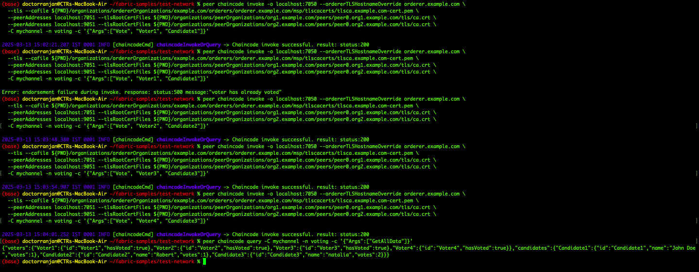

# 🚀 Hyperledger Fabric: Hello World & Voting System

## 📌 Introduction

This repository contains two projects built on **Hyperledger Fabric**:

1️⃣ **Hello World** – A simple **"first blockchain application"** to understand Fabric's structure.  
2️⃣ **Voting System** – A decentralized blockchain-based voting application ensuring security and transparency.  

Both projects use **Smart Contracts (Chaincode)** to interact with the Fabric ledger.

---

## 🛠️ Prerequisites

Ensure you have already **installed and set up Hyperledger Fabric** using the test network.  
If not, refer to the **[Hyperledger Fabric Setup Guide](https://github.com/hyperledger/fabric-samples)**.
and make sure to download the folder **[1HelloWorld_2VotingSystem](https://drive.google.com/drive/folders/1MRg-ccPb-hdPWKfznppQ2xdVPe-lzzS-?usp=sharing)**.

---

## 🚀 Steps to Initialize & Use **Hello World** and **Voting System**

The following **one shell script** contains **all necessary steps** to execute both projects **separately**:

### ==========================
### 1️⃣ HELLO WORLD SETUP
### ==========================


#### Step 1: Navigate to the Fabric Test Network
```bash
cd ~/fabric-samples/test-network 
```

#### Step 2: Start Fabric Network (if not running) adn create channel

```bash
./network.sh up createChannel
```
#### Step 3: Deploy Hello World Smart Contract

```bash
./network.sh deployCC -ccn hello -ccp ../chaincode/hello-world -ccl go
```


#### Step 4: Interact with Hello World Smart Contract

```bash
peer chaincode query -C mychannel -n hello -c '{"Args":["HelloWorld"]}'
```

echo "✅ Hello World Smart Contract Deployed Successfully!"


### ==========================
### 2️⃣ VOTING SYSTEM SETUP
### ==========================


#### Step 1: Navigate to the Fabric Test Network
```bash
cd ~/fabric-samples/test-network 
```

#### Step 2: Start Fabric Network (if not running) adn create channel

```bash
./network.sh up createChannel
```

#### Step 3: Deploy Voting System Smart Contract
```bash
./network.sh deployCC -ccn voting -ccp ../chaincode/voting -ccl go
```


#### Step 4.1: Initialize Ledger (Optional)
```bash
peer chaincode invoke -o localhost:7050 --ordererTLSHostnameOverride orderer.example.com \
  --tls --cafile ${PWD}/organizations/ordererOrganizations/example.com/orderers/orderer.example.com/msp/tlscacerts/tlsca.example.com-cert.pem \
  --peerAddresses localhost:7051 --tlsRootCertFiles ${PWD}/organizations/peerOrganizations/org1.example.com/peers/peer0.org1.example.com/tls/ca.crt \
  --peerAddresses localhost:9051 --tlsRootCertFiles ${PWD}/organizations/peerOrganizations/org2.example.com/peers/peer0.org2.example.com/tls/ca.crt \
  -C mychannel -n voting -c '{"Args":["InitLedger"]}'

```

#### Step 4.2: Register Voters
```bash
peer chaincode invoke -o localhost:7050 --ordererTLSHostnameOverride orderer.example.com \
  --tls --cafile ${PWD}/organizations/ordererOrganizations/example.com/orderers/orderer.example.com/msp/tlscacerts/tlsca.example.com-cert.pem \
  --peerAddresses localhost:7051 --tlsRootCertFiles ${PWD}/organizations/peerOrganizations/org1.example.com/peers/peer0.org1.example.com/tls/ca.crt \
  --peerAddresses localhost:9051 --tlsRootCertFiles ${PWD}/organizations/peerOrganizations/org2.example.com/peers/peer0.org2.example.com/tls/ca.crt \
  -C mychannel -n voting -c '{"Args":["RegisterVoter", "Voter1"]}'
```


#### Step 4.3: Register Candidates
```bash
peer chaincode invoke -o localhost:7050 --ordererTLSHostnameOverride orderer.example.com \
  --tls --cafile ${PWD}/organizations/ordererOrganizations/example.com/orderers/orderer.example.com/msp/tlscacerts/tlsca.example.com-cert.pem \
  --peerAddresses localhost:7051 --tlsRootCertFiles ${PWD}/organizations/peerOrganizations/org1.example.com/peers/peer0.org1.example.com/tls/ca.crt \
  --peerAddresses localhost:9051 --tlsRootCertFiles ${PWD}/organizations/peerOrganizations/org2.example.com/peers/peer0.org2.example.com/tls/ca.crt \
  -C mychannel -n voting -c '{"Args":["RegisterCandidate", "Candidate1", "John Doe"]}'
```


#### Step 4.4: Verify Registered Voters & Candidates
```bash
peer chaincode query -C mychannel -n voting -c '{"Args":["GetAllData"]}'
```


#### Step 4.5: Cast Votes
```bash
peer chaincode invoke -o localhost:7050 --ordererTLSHostnameOverride orderer.example.com \
  --tls --cafile ${PWD}/organizations/ordererOrganizations/example.com/orderers/orderer.example.com/msp/tlscacerts/tlsca.example.com-cert.pem \
  --peerAddresses localhost:7051 --tlsRootCertFiles ${PWD}/organizations/peerOrganizations/org1.example.com/peers/peer0.org1.example.com/tls/ca.crt \
  --peerAddresses localhost:9051 --tlsRootCertFiles ${PWD}/organizations/peerOrganizations/org2.example.com/peers/peer0.org2.example.com/tls/ca.crt \
  -C mychannel -n voting -c '{"Args":["Vote", "Voter1", "Candidate1"]}'
```




#### Step 4.5: Verify Votes
```bash
peer chaincode query -C mychannel -n voting -c '{"Args":["GetAllData"]}'
```


### ==========================
### SHUTDOWN INSTRUCTIONS
### ==========================
```bash
cd fabric-samples/test-network && ./network.sh down"
```
